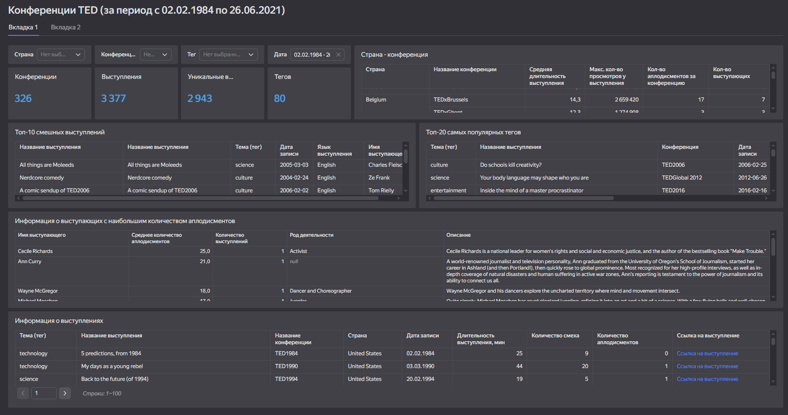

# Название проекта: Конференции TED (за период с 02.02.1984 по 26.06.2021)

## Задача
Построить дашборд для оценки популярности тем, географии проведения конференций, количества выступающих.

## Данные
В dataset'ах содержалась информация о конкретной конференции (место, дата, количество выступающих, количество просмотров на YouTube и т.д.), о выступающих (имя, специальность, интересы и т.д.)

## Анализ и выводы
Для анализа использовались SQL-запросы и формирование таблиц на дашборд.

**Пример SQL-запроса:**
```sql
WITH t1 AS (SELECT main_tag, count(talk_id)
FROM ted.talks tt JOIN ted.events te ON tt.event_id=te.conf_id
WHERE
    cast(film_date as DATE) BETWEEN {{dt_from}} AND {{dt_to}}
    AND ({{cntry}}='' OR country = {{cntry}})
    AND ({{tg}}='' OR main_tag = {{tg}})
    AND ({{conf}}='' OR event_name = {{conf}})
GROUP BY main_tag
ORDER BY count(talk_id) DESC
LIMIT 20)

SELECT t.title AS "Название выступления", t.description AS "Описание", t.main_tag AS "Тема (тег)", t.film_date AS "Дата записи", t.language_sp AS "Язык выступления", e.event_name AS "Конференция", s.speaker_name AS "Имя выступающего", t.laughter_count AS "Количество смеха", t.applause_count AS "Количество аплодисментов", t.views_count AS "Количество просмотров"
FROM ted.talks t 
JOIN t1 ON t.main_tag=t1.main_tag
JOIN ted.events e ON t.event_id=e.conf_id
JOIN ted.speakers s ON t.speaker_id=s.author_id
ORDER BY t.views_count DESC
```

## Визуализация


**Инструменты:** SQL, DataLens.
